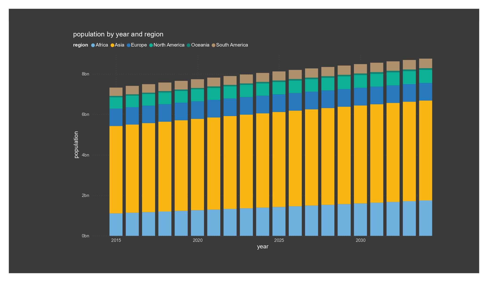
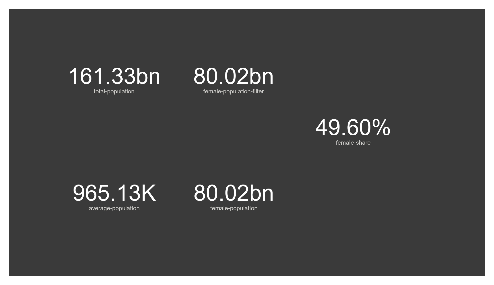
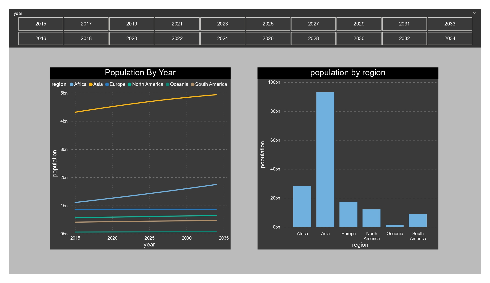
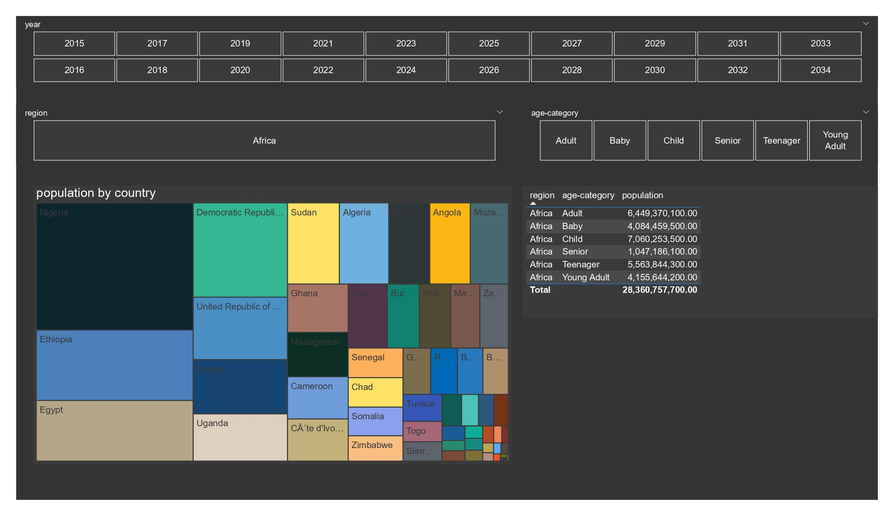
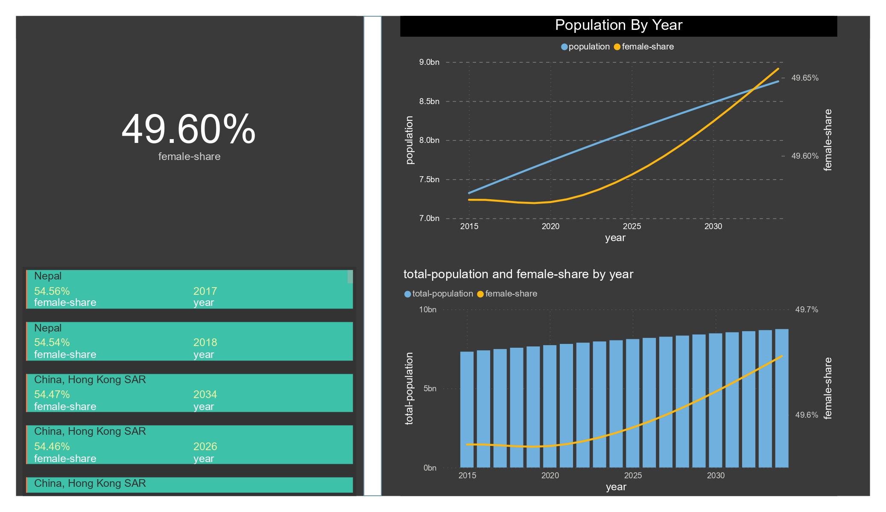

# Power BI - Data visualization about World Population
Microsoft Power BI - The Practical Guide 2024 By Manuel Lorenz,Academind by Maximilian Schwarzmüller and Maximilian Schwarzmüller

From this course I learned about power bi tools and fundamentals such as Data preparation, Data Transformation, Data Model, and creating report views using various charts.

# Visualization Chart

1. Stacked Column Chart
<figure style="margin-bottom:20px;">
  
</figure>

2. Measure
<figure style="margin-bottom:20px;">
  
</figure>

3. Line & Column
<figure style="margin-bottom:20px;">
  
</figure>

4. Treemap & Table
<figure style="margin-bottom:20px;">
  
</figure>

5. Cards
<figure style="margin-bottom:20px;">
  
</figure>

